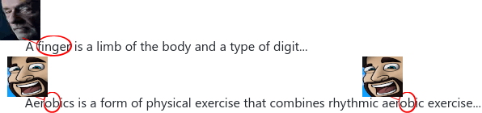
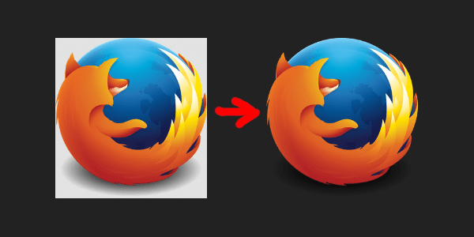

# Commenter25/userstuffs
a collection of userstyles and userscripts i made that aren't big enough projects for their own repo

## ⭳ Downloads
🎨 = UserStyle | 📜 = UserScript  
For userstyles, [Stylus is recommended](https://github.com/openstyles/stylus#stylus). For userscripts, [Violentmonkey is recommended](https://violentmonkey.github.io/).  
Click a name, and if you have a working extension, an install window should appear.

### 🎨 [Dark Example](darkexample/darkexample.user.css?raw=1)

[**1.0.0**](darkexample/CHANGELOG.md) - _Applies to `example.com`, `example.net`, and `example.org`_

Native dark mode will be everywhere. Even Example Domain.

### 🎨 [raevision](raevision/raevision.user.css?raw=1)

[**1.0.0**](raevision/changelog.md) - _applies to everything, everywhere_

hate uppercase letters? do they fill you with spite? hatred? would you rather everything be small, [nano](https://nano.lgbt) sized letters? now nobody has a choice! all you will ever see is lowercase letters. unless they're in an image. or not in your browser. or some weird css specificity edge case overrides this.

<picture>
  <source media="(prefers-color-scheme: dark)" srcset="raevision/preview-dark.png">
  
</picture>

### 📜 [Reference Detector](refdetect/refdetect.user.js?raw=1)

[**1.0.2**](refdetect/CHANGELOG.md) - _Applies to everything, everywhere_

We've all wandered the web and wondered "wow, i wonder if what i'm witnessing is a reference to something?". Never live in doubt again, for this script uses the tried and true clickbait strategy of red circles to draw your eyes to any reference you wish!

...as long as the website you're on:
  - does not have a strict content security policy
  - does not overuse `overflow: hidden`
  - does not have overly specific styling

By default, it will detect [nano](https://nano.lgbt) references, and you can configure it to anything you wish, like [OB](refdetect/ob.webp?raw=1) or [Finger](refdetect/finger.webp?raw=1)!

<picture>
  <source media="(prefers-color-scheme: dark)" srcset="refdetect/preview-dark.png">
  
</picture>

### 🎨 [Transparent Standalone Images](tpimgs/tpimgs.user.css?raw=1)

[**1.0.1**](tpimgs/CHANGELOG.md) - _Applies to any URL containing `png`, `webp`, or `gif`_

Recreation of the [identically named Firefox extension](https://addons.mozilla.org/en-US/firefox/addon/transparent-standalone-image/), which fixes a bug with directly viewed transparent images rendering on a white background. There are likely limitations compared to the extension, but for most purposes it should work without requiring trusting an entire browser extension. Feel free to report anything it doesn't catch!

### 🎨 [Xenia as Linux Icon](xeniasteam/xeniasteam.user.css?raw=1)

[**1.0.3**](xeniasteam/CHANGELOG.md) - _Applies to `steampowered.com`_

Replaces the SteamOS/Linux icon with the real Linux mascot. Credit to [Zaeroses](https://chitter.xyz/@Zaeroses) for the [Xenia SVG](https://github.com/Zaeroses/refind-icons/blob/main/os_linux.svg), which is under the Unlicense. And credit to [nano](https://nano.lgbt) for the idea!

## © Licenses & Distribution
Userstyles are probably under the Unlicense, and userscripts are probably under the MIT license. Check the individual files for their correct license to be sure. It should be on the 5th line.

For a multitude of reasons involving privacy, security, and sanity; I **do not publish my styles on userstyles.org**, and neither should you. The only official sources are this repository (Commenter25/userstuffs) and my mirrored versions on userstyles.world. It's important to trust even your userstyles, as [CSS injection attacks do exist](https://www.mike-gualtieri.com/css-exfil-vulnerability-tester).

My userscripts are currently only available on this repository.
